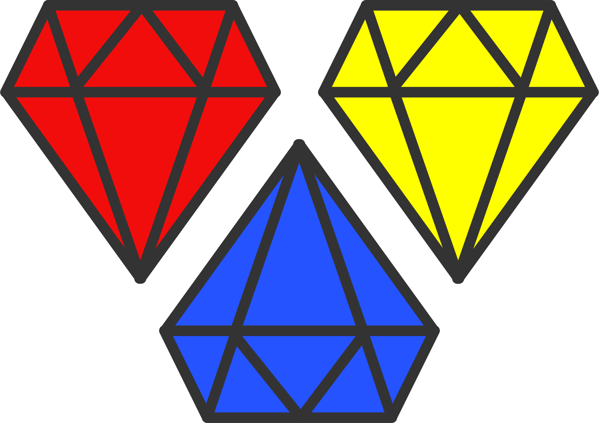

# README for wxRuby3

Reviving wxRuby

## Introduction

wxRuby3 is a cross-platform GUI library for Ruby, based on the [wxWidgets](https://wxwidgets.org)
GUI toolkit for C++. It uses native widgets wherever possible, providing
the correct look, feel and behaviour to GUI applications on Windows, OS
X and Linux/GTK. wxRuby aims to provide a comprehensive solution to
developing professional-standard desktop applications in Ruby. 

## wxRuby3 licence

wxRuby3 is free and open-source. It is distributed under the liberal
MIT licence which is compatible with both free and commercial development.
See [LICENSE](LICENSE) for more details.

### wxRuby3 and wxWidgets

If you distribute (your) wxRuby3 (application) with a binary copy of wxWidgets,
you are bound to the requirements of the copy of wxWidgets within. Fortunately,
those requirements do not impose any serious restrictions.

### wxWidgets License Summary (from wxWidgets)

In summary, the licence is LGPL plus a clause allowing unrestricted
distribution of application binaries. To answer a FAQ, you don't have to
distribute any source if you wish to write commercial applications using
wxWidgets.

### Required Credits and Attribution

Generally, neither wxWidgets nor wxRuby3 require attribution, beyond
retaining existing copyright notices. However, if you build your own
custom wxWidgets library, there may be portions that require specific
attributions or credits, such as TIFF or JPEG support. See the wxWidgets
README and license files for details.
See [here](CREDITS.md) for more details on and acknowledgement of the developers 
of these products.

## FAQ
 
### What platforms and operating systems are supported in wxRuby3?

Currently the following are fully supported:

* Windows 10 (RubyInstaller MSYS2-DevKit) / Ruby >= 2.5 / wxWidgets >= 3.2
* Linux (i686 + AMD-64) / Ruby >= 2.5 / wxWidgets >= 3.2

Support for other platforms is not being actively developed at present,
but patches are welcome. It is likely to be much simpler to get wxRuby
working on similar modern systems (eg FreeBSD or Solaris with GTK) than
on legacy systems (eg Windows 98, Mac OS 9).

### Where can I ask a question, or report a bug?

Use GitHUb Issues.

When asking a question, if something is not working as you expect,
please provide a *minimal*, *runnable* sample of code that demonstrates
the problem, and say what you expected to happen, and what actually
happened. Please also provide basic details of your platform, Ruby,
wxRuby and wxWidgets version, and make a reasonable effort to find answers 
in the archive and documentation before posting. People are mostly happy
to help, but it's too much to expect them to guess what you're trying to
do, or try and debug 1,000 lines of your application.
Very important also; do not use offensive language and be **polite**.

### How can I learn to use wxRuby?

wxRuby3 is a large API and takes some time to learn. The wxRuby3
distribution comes with numerous samples which illustrate how to use
many specific parts of the API. A good one to start with is the
'minimal' sample, which provides an application skeleton. All the
bundled samples are expected to work with current wxRuby3, although
some use a more modern coding style than others.

Complete (more or less) wxRuby API documentation should be part of any
complete wxRuby3 build. This tends to focus on providing a reference
of all available modules, classes ad methods and how to use specific 
classes and methods, rather than on how to construct an application 
overall.
This documentation (for the latest release) is also available online
[here](https://mcorino.github.io/wxRuby3/file.00_starting.html).

One of the advantages of wxRuby3 is the much larger ecosystem of
wxWidgets and wxPython resources out there. There is a book for
wxWidgets, "Cross-Platform Programming in wxWidgets", which can be freely
downloaded as a PDF. This provides very comprehensive coverage of the
wxWidgets API in C++. The code may not be directly useful but the
descriptions of how widgets and events and so forth work are almost
always relevant to wxRuby3 (and should be fairly easily relatable).

When using a search engine to find answers about a wxRuby3 class, it can
be worth searching for the same term but with 'wx' prepended. For
example, if you wanted answers about the "Grid" class, try searching for
"wxGrid" as this will turn up results relating to wxWidgets and wxPython
which may be relevant.

### What wxWidgets features are supported by wxRuby3?

wxRuby supports almost all of the wxWidgets 3.x GUI API, providing over
600 classes in total. wxWidgets classes that provide general and/or non-GUI 
programming support features, such as strings, networking, threading, database
access and such are not and will never be ported, as it's assumed that 
in all these cases it's preferable to use pure Ruby features.

If you know of a feature in wxWidgets that you would like to see
supported in wxRuby3 you are free to ask but do not **EXPECT** unconditional 
agreement or immediate response. 

### How does wxRuby3 relate to the wxRuby 2.0 (and even older 0.6.0 release)?

wxRuby 0.6.0 was the last in a series of releases developed using a
different approach in the early days of wxRuby. Work on this series
stopped in early 2005, in favour of what became wxRuby 2.0. This project
in turn stopped being supported in 2013.
Several years of development have passed for wxWidgets and Ruby respectively,
improving code quality, adding new classes and new language features.
In 2022 I finally found the time and the inspiration to pick up this project
with the idea of reviving it to build some applications I had in mind.
wxRuby 3 intents to provide Ruby interfaces for all relevant (!) wxWidget
classes of the latest version 3.2 and beyond. 
Building on the experiences of the previous wxRuby (2) developments as well
as the wxPython Phoenix project it is expected to provide a better and more
maintainable solution.

### I am getting an error trying to install or compile wxRuby3

Please double-check the [INSTALL](INSTALL.md) documents, and search issue archives. If 
this doesn't help, please post your question using GitHub Issues.
